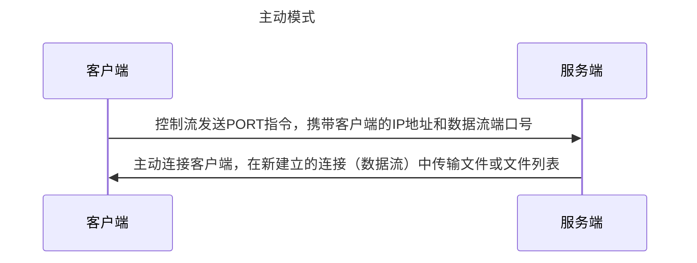
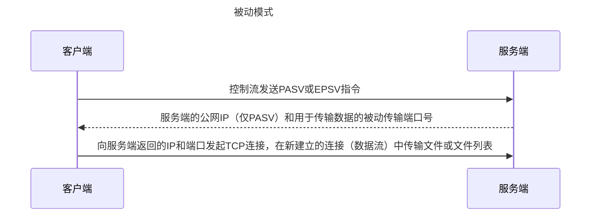

---
# This is the title of the article
# title: One-click Script
# This is the icon of the page
icon: fa-solid fa-file-binary
# This control sidebar order
order: 12
# A page can have multiple categories
category:
  - Guide
# A page can have multiple tags
tag:
  - Advanced
  - Guide
# this page is sticky in article list
sticky: true
# this page will appear in starred articles
star: true
---

# FTP / SFTP

::: tip

所有在网页端管理页面对 FTP 相关配置进行的调整必须重启 AList 才会生效。

使用 FTP 下载时只会使用本地代理。

:::

## **FTP 配置文件**

| 字段     | 含义 | 示例值                       |
| -------- | -- | --------------------------- |
| enable | 是否启用 | `true` / `false` |
| listen | (允许访问的IP掩码):端口 | `":5221"`（默认） / `"0.0.0.0:21"` / `"127.0.0.1:2121"` |
| find_pasv_port_attempts | 被动传输时因端口冲突而重新寻找端口的最大尝试次数 | `50`                       |
| active_transfer_port_non_20 | 启用20以外的端口作为主动传输端口                 | `true` / `false`       |
| idle_timeout | 客户端无请求情况下的最长待机时间（秒） | `900`               |
| connection_timeout | 连接超时时间 | `30`        |
| disable_active_mode | 禁用主动传输模式 | `true` / `false` |
| default_transfer_binary | 默认以二进制模式传输 | `true` / `false` |
| enable_active_conn_ip_check | 主动传输模式下对数据流TCP连接的客户端进行IP检查 | `true` / `false` |
| enable_pasv_conn_ip_check | 被动传输模式下对数据流TCP连接的客户端进行IP检查 | `true` / `false` |

## **FTP 设置**

在了解 FTP 的设置选项前需要先了解 FTP 协议的工作方式，FTP 协议使用**两个 TCP 连接**进行交互，它们分别被称为“**控制流**”和“**数据流**”，21 号端口是 FTP 协议的默认控制流端口号，FTP 服务器会持续监听这一端口号等待客户端的连接并给出响应，**控制流只传输客户端的请求指令和服务端的错误信息，不传输文件内容和文件列表**。在 AList 中，控制流端口号由配置文件内的`listen`参数确定，默认为 5221，客户端必须能够访问服务端的这一端口，协议才可以正常工作。

而数据流的建立主要有两种方式，被称为“主动模式”和“被动模式”：

在主动模式下，客户端主动监听一个端口，并通过`PORT`指令将端口号发送给服务端，服务端主动连接客户端并传输文件或文件列表。在这种模式下，客户端需要能够被服务端直接访问，因此在当前 NAT 普及的情况下几乎只有服务端和客户端处在同一子网内时才能发挥作用。



在被动模式下，客户端首先在控制流中发送`PASV`或`EPSV`命令，要求服务端新监听一个数据流端口，服务端在控制流中向客户端返回新监听的端口的端口号，待客户端与该端口建立连接以后再进行数据传输。在这种模式下，服务端不主动向客户端发起连接，因此只需要服务端处在 NAT 之外即可，但因为被动传输的传输端口不是预先确定，而是在连接发起前才确定的，因此在面对服务端和客户端之间存在端口映射，或服务端仅有一部分端口允许客户端连接的复杂网络环境时就需要额外配置。



- FTP 服务端公网地址

  在`PASV`命令中服务端向客户端发送的 IP 地址，如果服务端和客户端在同一子网内，用服务端的内网 IP 地址也可以，甚至如果服务端和客户端是同一台主机，也可以使用`127.0.0.1`。但如果服务端和客户端不在同一子网内，则需要填写能够让客户端访问到的服务端 IP 地址。

  也可以填写域名，此时会使用默认 DNS 将域名解析为 IP 地址，但是由于`PASV`只能传递 IPv4 地址，所以这里填写的域名如果既有 AAAA 记录，又有 A 记录，会自动使用 A 记录，如果填写一个只有 AAAA 记录，没有 A 记录的域名，产生的结果是未知的。

  该字段不影响`EPSV`指令，但该字段无效会导致 FTP 服务器放弃启动，所以如果你的 FTP 客户端只使用 `EPSV`指令，可以考虑这里保留默认值`127.0.0.1`。

- FTP 被动传输端口映射

  该字段由一系列以英文逗号`,`或换行符隔开的“映射组”构成，“映射组”的合法形式有以下四种：

  1. `<端口号>`
  2. `<端口号区间开始>-<端口号区间结束（含，下同）>`
  3. `<响应端口号>:<监听端口号>`
  4. `<响应端口号区间开始>-<响应端口号区间结束>:<监听端口号区间开始>:<监听端口号区间结束>`

  以上所有端口号必须在 1024 到 65535（含）之间，且区间开始端口号小于区间结束端口号。

  对于本字段留空的情况，服务端会选择 1024 到 65535 之间任意端口用于被动传输，且不进行任何映射。

  每填写一个“映射组类型1”，这个映射组里的端口就会被用于被动传输，且该端口不进行任何映射。

  每填写一个“映射组类型2”，这个映射组里从开始到结束之间的每个端口都会被用于被动传输，且这些端口不进行任何映射。

  每填写一个“映射组类型3”，这个映射组里的“监听端口号”会被用于被动传输，但当服务器选择使用这个端口时，会向前端返回“响应端口号”。

  “映射组类型4”要求英文冒号`:`前后两个区间长度相等，每填写一个“映射组类型4”，映射组里的两个区间可以形成一一对应的配对，每一对端口号视为一个“映射组类型3”。

  以下这些填写方式是合法的：

  - `1024`
  - `4001-5000,5001-6000:50001-51000<换行>4000:65535`

  以下这些填写方式是非法的：

  - `1023`（小于 1024）
  - `65536`（大于 65535）
  - `4000, 5000`（逗号后面有一个空格）
  - `2000 - 3000 : 4000 - 5000`（每一个空格都是非法的）
  - `2000-2001:3000-3002`（映射关系两边区间长度不一）

  如果该字段是非法的，服务端会选择 1024 到 65535 之间任意端口用于被动传输，且不进行任何映射。

  有关端口映射的设计是为了解决外部端口映射的复杂情况的，试想服务端运行在一个 docker 容器内，使用 2000 进行被动传输，但 docker 将容器内的 2000 端口映射在了容器外的 12000 端口，你就可以使用`12000:2000`的配置实现这样的效果：

  ```mermaid
  sequenceDiagram
      participant 客户端
      participant 端口映射
      participant 服务端
      
      客户端->>服务端: 发送EPSV指令
      服务端-->>客户端: 返回12000
      客户端->>端口映射: 连接12000端口
      端口映射->>服务端: 转发到2000端口
  ```

  如果服务器与客户端之间存在多层端口映射，`:`之前只需要填写最靠近客户端的端口号，之后只需要填写最靠近服务端的端口号即可，比如以下场景填写`2000:5000`：

  ```mermaid
  sequenceDiagram
      participant 客户端
      participant 内网穿透服务
      participant 软路由端口转发
      participant Docker 容器端口映射
      participant AList 进程
      
      客户端->>内网穿透服务: 2000
      内网穿透服务->>软路由端口转发: 3000
      软路由端口转发->>Docker 容器端口映射: 4000
      Docker 容器端口映射->>AList 进程: 5000
  ```

- FTP 代理 User-Agent 请求头

  某些存储驱动在访问时需要用到 User-Agent 请求头，随便写一个假的就行。

- 强制 FTP 连接使用显式 TLS

  强制使用 ftpes 协议，这种协议只加密数据流，不加密控制流。

  打开“启用 FTP 隐式 TLS”选项时，该选项会被忽略。

  如果没有提供有效的 TLS 私钥和证书，也没有开启此选项，表示服务端只接受 ftp 协议。

  如果提供了有效的 TLS 私钥和证书，但没有开启此选项，表示服务端既接受 ftp 协议，也接受 ftpes 协议。

  如果没有提供有效的 TLS 私钥和证书，但开启了此选项，FTP 服务器会放弃启动。

- 启用 FTP 隐式 TLS

  使用 ftps 协议，这种协议既加密数据流，又加密控制流，所以不能和 ftp、ftpes 协议兼容。

  打开此选项时，“强制 FTP 连接使用显式 TLS”选项会被忽略。

  如果没有提供有效的 TLS 私钥和证书，但开启了此选项，FTP 服务器会放弃启动。

- FTP TLS 私钥路径

  TLS 私钥文件路径，留空或无效表示不启用 TLS。

  启用 TLS 可能意味着客户端需要使用域名访问服务器，但“FTP 服务端公网地址”仍可以填写 IP 地址。

- FTP TLS 证书路径

  TLS 证书文件路径，留空或无效表示不启用 TLS。

## **SFTP 配置文件**

| 字段     | 含义 | 示例值                       |
| -------- | -- | --------------------------- |
| enable | 是否启用 | `true` / `false` |
| listen | (允许访问的IP掩码):端口 | `":5222"`（默认） / `"0.0.0.0:22"` / `"127.0.0.1:2222"` |