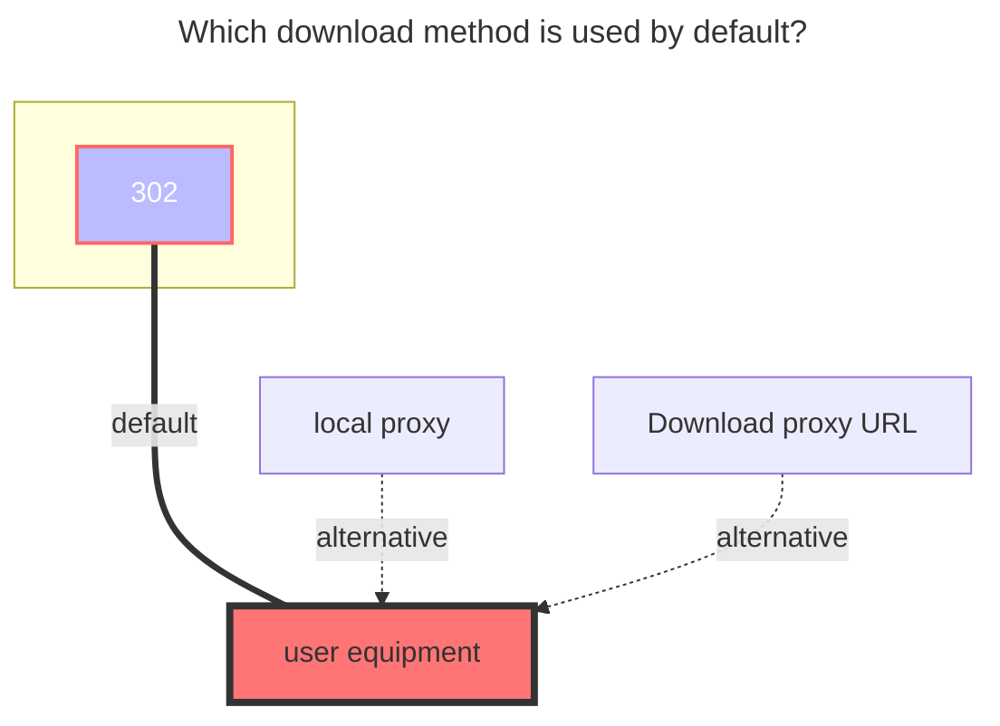

---
# This is the icon of the page
icon: iconfont icon-state
# This control sidebar order
order: 25
# A page can have multiple categories
category:
  - Guide
# A page can have multiple tags
tag:
  - Storage
  - Guide
  - "302"
# this page is sticky in article list
sticky: true
# this page will appear in starred articles
star: true
headerDepth: 5
---

# 115 Open

::: tip

Developed using [**115 Open Platform**](https://open.115.com/)

:::

<br/>


## **Get refresh token**

- **https://alist.nn.ci/tool/115/token**


<br/>


### **Precautions**

::: warning Token leakage post-processing method

If the Token is accidentally leaked, you can immediately obtain a new refresh token. The previous one will become invalid. After the invalidation, the following content will be displayed:

```html
failed get objs: failed to list objs: error: refresh token error, errno: 0
```

:::

The newly obtained refresh token cannot be directly replaced in the original driver. The API interface has limited flow and cannot be refreshed continuously in a short period of time. You can only delete the original driver and add it again (if it is still prompted, wait 1 minute and try again, use a new `refresh token`)

```html
Failed init storage but storage is already created: failed init storage: error: refresh frequently, errno: 0
```

<br/>


## **Root folder ID**

Open the official website of 115 Cloud and click the string behind the url when you click into the folder you want to set, 

such as <https://115.com/?cid=249163533602609229&offset=0&tab=&mode=wangpan>, 

which is `249163533602609229`


<br/>

### **The default download method used**


