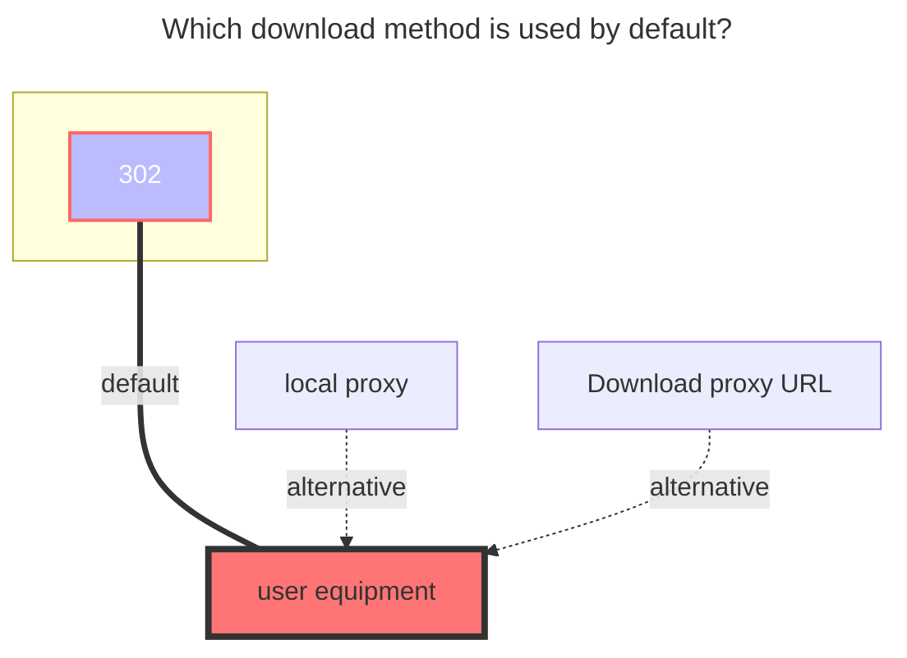

---
# This is the icon of the page
icon: iconfont icon-state
# This control sidebar order
order: 21
# A page can have multiple categories
category:
  - Guide
# A page can have multiple tags
tag:
  - Storage
  - Guide
  - "302"
  - Official
# this page is sticky in article list
sticky: true
# this page will appear in starred articles
star: true
headerDepth: 5
---

# 115 Open

::: tip

Developed using the official [**115 Open Platform API**](https://open.115.com)

:::

::: danger Please read the precautions carefully

Please use your account in a standardized manner. Do not use it for distribution services including but not limited to **`multi-person sharing`**, **`image hosting, software hosting`** and **`video external links to video websites for playback`**, as well as some other irregular uses not mentioned above. You will be responsible for the consequences of your account being blocked.

:::

<br/>


## **Get refresh token**

- **https://alist.nn.ci/tool/115/token**

Scan the QR code with your phone and click the blue button to get `refresh token`

When filling in the drive information, you only need to fill in **`refresh token`**, and you don’t need to fill in `access token`


<br/>


### **Precautions**

::: warning Token leakage post-processing method

If you accidentally leak the Token, you can go to 115 Device Login Management to deauthorize the app.

- 115 APP：【**iOS**、**Android**】 version requires ≥ 35.11.0
- 115 Web：**https://115.com/?mode=device_manage**

After invalidation, the following content will be displayed:

```json
failed get objs: failed to list objs: code: 40140116, message: no auth
```

An account can obtain `Refresh token` twice from the same application. After the third acquisition, the `Refresh token` obtained first will become invalid. Using the first `Refresh token` will prompt the above error.


:::


### **Get a refresh token using another APP ID**

For example, use your own developer application ID to obtain a refresh token. Before obtaining a refresh token, fill in the application`APP ID` and then click the Get Refresh Token button.


<br/>

## **Root folder ID**

Open the official website of 115 Cloud and click the string behind the url when you click into the folder you want to set, 

such as <https://115.com/?cid=249163533602609229&offset=0&tab=&mode=wangpan>, 

which is `249163533602609229`


<br/>

### **The default download method used**


