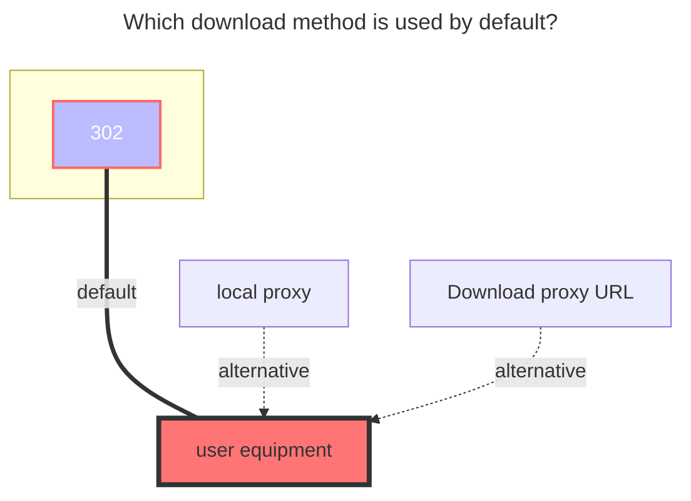

---
# This is the icon of the page
icon: iconfont icon-state
# This control sidebar order
order: 7
# A page can have multiple categories
category:
  - Guide
# A page can have multiple tags
tag:
  - Storage
  - Guide
  - "302"
# this page is sticky in article list
sticky: true
# this page will appear in starred articles
star: true
---
# 139Yun

Cloud disk address: **<https://yun.139.com/>**

:::warning

The alist version must be greater than `v3.41.0` to use this tutorial.

:::

:::tip

Parameters can be obtained from the browser DevTools -> Network by [searching keywords](#search-keywords).

:::

 

## **Proxy Range**

You need to enable `Web Proxy` or`Webdav Native Proxy` to take effect

- Currently only applicable to: `alias`、`139Yun`、`AList V3`

  - Function Description: **<https://github.com/alist-org/alist/pull/6496#issue-2309839607>**

 

## **Authorization**

Update the method of authentication, please get `Authorization` to fill in

:::warning

Fill in the content starting after the Basic and a space, **do not include Basic**!

:::

## **Type**

Alist currently supports 4 types of cloud storage:

- Personal New: New API

  - Note: The account has been migrated to a new personal cloud by the end of 2024

  - Use the PUT method to directly connect to EOS multipart uploads

- Family: My Family -> Family Files

  - Limit: The Family Cloud does not support copying, moving, or renaming folders, and files cannot be uploaded to the root directory

  - Use the POST method to resumable uploads

- Group: Shared Group

  - Limit: Shared groups do not support copying and uploading

- Personal: The old personal cloud, which is a thing of the past.

 

## **Root folder ID**

Specifies the directory to be mounted.

:::warning

Please remember to clear or change this Root folder ID after changed the Type!

:::

- Personal New: `/`. It can be left blank and it will be filled in automatically.

  - If you want to list a folder separately, please enter the folder ID.

- Family: If the root directory is empty, all files are filed.

  - If you want to list a folder separately, please enter the folder ID.

- Group: If the root directory is empty, the group ID will be automatically filled. It is recommended to enter the folder ID that you manually obtained.

  - If you want to list a folder separately, please enter the folder ID.

  - Note: If you want to mount a group created by others, be sure to fill in the folder ID that you manually obtained, otherwise there will be an infinite loop in the first-level folder.

- Personal: `root`. It can be left blank and it will be filled in automatically. All will be listed, covering 18 items (check it yourself). Normal files are in **My Folder**.

  - If the write folder ID is listed in the normal root folder.

 

## **Cloud ID**

Personal cloud does not need to fill in, **Family / Group cloud is dedicated**.

- Family: family ID, **cannot be empty**

- Group: group ID, **cannot be empty**

 

## **Custom upload part size**

The upload part size (bytes) can be customized by the user, and if there is a performance issue, please adjust it yourself. Set '0' to 100 MB by default.

- The current upload part size on the web is 20 MB (20971520).

- The [EOS documentation](https://ecloud.10086.cn/op-help-center/api/article/40933) used by the new version of the Personal Cloud states that "objects larger than > 5 GB cannot be uploaded", so the upload part size should not exceed 5 GB.

## **Other**

- Other information is taken from the request, which has changed from cookie to obtaining `Authorization`
  - The new personal cloud can be obtained in another way. See the picture example of [Personal new](#personal-new)

- If you can't find the load on the bottom of the request information, go to the top `on the top of the upper row, marked the purple highlight

 

### **Search keywords**

Pay attention to the keywords, use it below to get **`authorization`**, **Root folder ID** and **Cloud ID**

- Personal Cloud: **getDisk**
- Family Cloud: **queryContentList**

- Personal New: hcy/file/**list**

  - Headers - `Authorization`

  - Payload - `parentFileId`: folder ID

- Family: **queryContentList**

  - Headers - `Authorization`

  - Payload - `cloudID`: family ID

  - Payload - `catalogID`: folder ID

  - Response - `data.path`: full folder ID

- Group: **queryGroupContentList**

  - Headers - `Authorization`

  - Payload - `groupID`: group ID

  - Payload - `path`: full folder ID

- Personal: **getDisk**

 

### **Personal new:**

  
    

 

### **Personal cloud:**

  
    
    

 

### **Family cloud:**

  
    
    

::: details Teaching video

Although the video is V2 version, the way to obtain the directory ID and the cloud ID is the same.

**<https://www.bilibili.com/video/BV1US4y1w79a>**

From the previous way to get cookies, now replaced it with `Authorization`，You can see the [Fill in the Example](#alist-fill-in-examples) tutorial below

:::

 

### **AList fill in examples:**

- ==`Authorization`Just fill in the content of the start after the basic space==
- The new personal cloud folder ID will automatically change after you enter the folder. Just open whichever folder you need, and then get the value of `currentCatalogID`^Figure_3^

  
    
    
    

 

### **The default download method used**

