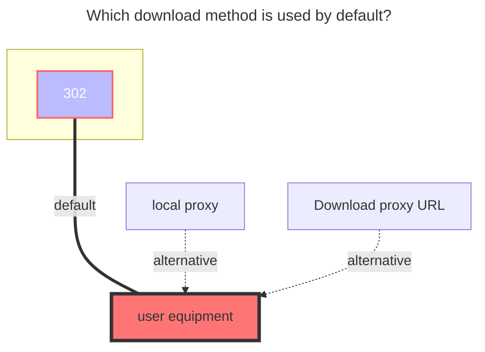

---
# This is the icon of the page
icon: iconfont icon-state
# This control sidebar order
order: 13
# A page can have multiple categories
category:
  - Guide
# A page can have multiple tags
tag:
  - Storage
  - Guide
  - "302"
# this page is sticky in article list
sticky: true
# this page will appear in starred articles
star: true
---

# Moment album

## **Cookie** <Badge text="v3.41.0" type="info" vertical="middle" />

Log in [Yike Photo Album](https://photo.baidu.com) Open F12 and find a request carrying a `Cookie` value and copy it

 

 

## **Album_id**

- **When the default is empty, all albums in the root directory will be displayed directly.**
- If you want to mount a single album, you need to fill in the following content

- album_id should be filled in: {album_id}|{tid} Example: 4021858707431029901|316519298447849660

- {album_id} : After entering the album you need to mount, the ID after viewing the top link /album is {album_id}

  - https://photo.baidu.com/photo/web/album/4021858707431029901 
  - **4021858707431029901** is {album_id}

- {tid}: Visit **https://photo.baidu.com/youai/album/v1/list?limit=1000** to get it.
  - After entering the interface, `Ctrl+F` searches for the ID above, and you can see the corresponding {tid} in the following lines

 

## **Display type** 

Choose according to your needs

 

## **Delete origin**

<i class="fa-solid fa-triangle-exclamation fa-lg" style="color: #ff0000;"></i>‪‪ ‪ By default, it just removes the album, not the real deletion. If you enable this option to delete the file, it will be completely deleted. Please enable it carefully.

 

### **The default download method used**

