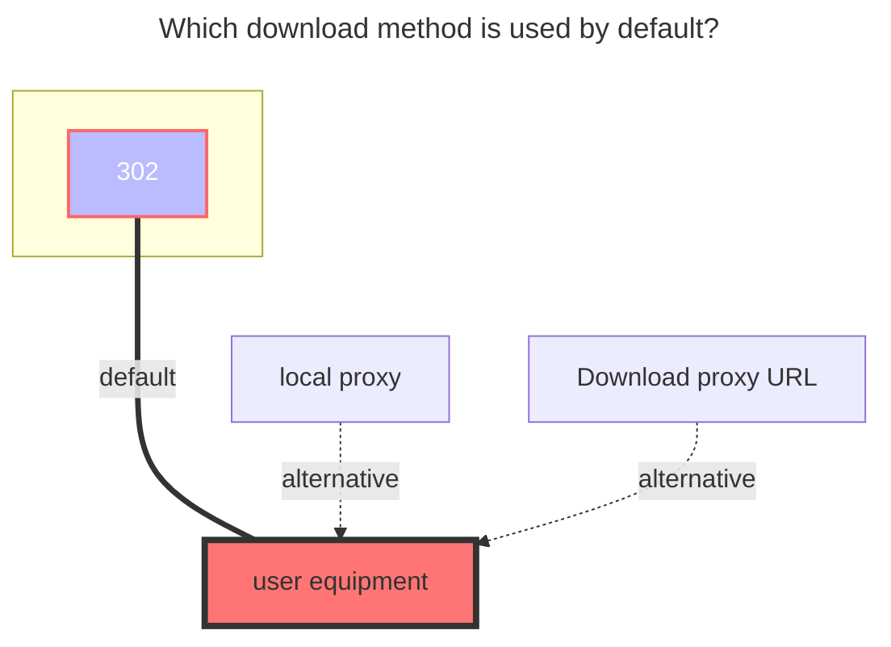

---
# This is the icon of the page
icon: iconfont icon-state
# This control sidebar order
order: 256
# A page can have multiple categories
category:
  - Guide
# A page can have multiple tags
tag:
  - Storage
  - Guide
  - "Native Rroxy"
  - "302"
# this page is sticky in article list
sticky: true
# this page will appear in starred articles
star: true
---
# Cloudreve V3

## Parameters

### Address

The address of the Cloudreve V3 server, such as: `https://www.example.com`. It is better to remove the slash `/` after it.

### Authentication

Cloudreve V3 supports authentication using Cookie. This means the mounting authentication methods are divided into:

1. `Username` + `Password`: Automatically uses the login interface to obtain Cookie, there might be issues with CAPTCHA.
2. `Cookie` Only: Can be temporarily used but will expire and cannot be renewed. Parameters can be found from browser requests or Local Storage.
3. [Reference](../drivers/common.html#Reference): Fill in `ref:/{mount path}` in `Remark`: Reference authentication, tokens, etc., from "Mounted Storage".

Steps to get cookie:

::: tip
Only the string following cloudreve-session= is required.
:::

### Root Folder Path

Default is `/`, which can be obtained from the `?path=` in the web link. The obtained parameters may need to be [URL decoded](https://www.google.com/search?q=URL+decode).

### Enable Folder Size

Enable Cloudreve V3 server to calculate the size of each folder and generate thumbnails for each file. Enabling this feature may cause server errors or slow performance, and it is `disabled` by default.

### Custom UA

Used to customize the `User-Agent` header information used in requests. Leaving it blank will use Alist default settings.

## Upload

The supported storage policies for uploading are as follows:

- Local storage
- Slave storage
- OneDrive
- S3

Upload storage policies can be set within Cloudreve V4 web interface by entering the corresponding folder (requires the server to be Cloudreve Pro).

## **The default download method used**

