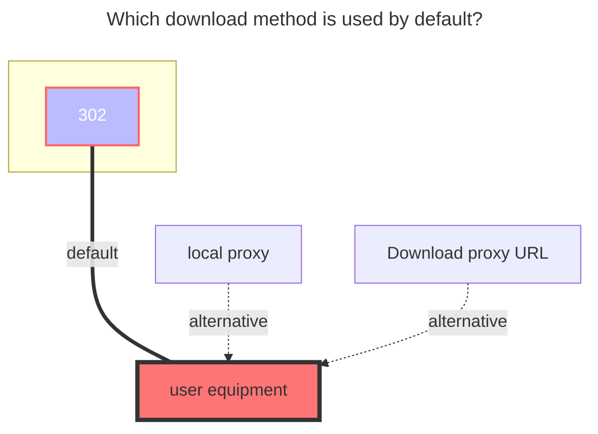

---
# This is the icon of the page
icon: iconfont icon-state
# This control sidebar order
order: 40
# A page can have multiple categories
category:
  - Guide
# A page can have multiple tags
tag:
  - Storage
  - Guide
  - "302"
# this page is sticky in article list
sticky: true
# this page will appear in starred articles
star: true
---
# GitHub API

:::tip
GitHub API does not support operating files larger than 100MiB and folders containing more than 100,000 sub-items.

All `.gitkeep` files will be managed by the driver and will be invisible to the user.

Operations on submodules are currently not supported.
:::

## **Token**

1. Log in GitHub and visit <https://github.com/settings/tokens>.
2. 
3. 
4. 

## **Owner**

The owner of the repository. For example, if the URL of the repository is `github.com/AAA/BBB`, fill in `AAA` here.

## **Repo**

The name of the repository. For example, if the URL of the repository is `github.com/AAA/BBB`, fill in `BBB` here.

## **Ref**

A branch, a tag or a commit SHA. Only when a branch name is filled in is the driver writable. It defaults to the default branch if not filled.

## **Gh Proxy**

Used to speed up downloading

- Download the content of `Raw` and `archive` and change it to **https://gh-proxy.com/raw.githubusercontent.com**

```bash title="Copy"
https://gh-proxy.com/raw.githubusercontent.com
```

```bash title="Copy"
https://ghfast.top/raw.githubusercontent.com
```

```bash title="Copy"
https://ghproxy.net/raw.githubusercontent.com
```

## **GPG private key**

GPG private key, used to provide commit verifications. Verified commits will be marked with a green "Verified" label on the GitHub webpage. Use the following command to obtain it. Leave blank if verifications are not needed.

```bash
gpg --export-secret-key -a <Key Pair ID>
```

## **GPG key passphrase**

Passphrase to the GPG private key. Leave blank if there is none.

## **Committer name**

Custom committer name, defaulting to the owner's of the token when not filled.

## **Committer email**

Custom committer name, defaulting to the owner's of the token when not filled.

Required when "Committer name" is filled. Required to be empty when "Committer name" is empty.

## **Author name**

Custom author name, defaulting to the owner's of the token when not filled.

## **Author email**

Custom author name, defaulting to the owner's of the token when not filled.

Required when "Author name" is filled. Required to be empty when "Author name" is empty.

## **commit message**

Custom commit message, supporting the following template variables：
- `UserName`: the user operating the file.
- `ObjName`: the name of the file (or the folder) operated.
- `ObjPath`: the path to the file (or the folder) operated.
- `ParentName`: the name of the parent folder of the file (or the folder) operated.
- `ParentPath`: the path to the parent folder of the file (or the folder) operated.
- `TargetName`: (when renaming) new name. (when copying and moving) the target folder name.
- `TargetPath`: (when renaming) new path. (when copying and moving) the target path.

### **The default download method used**



