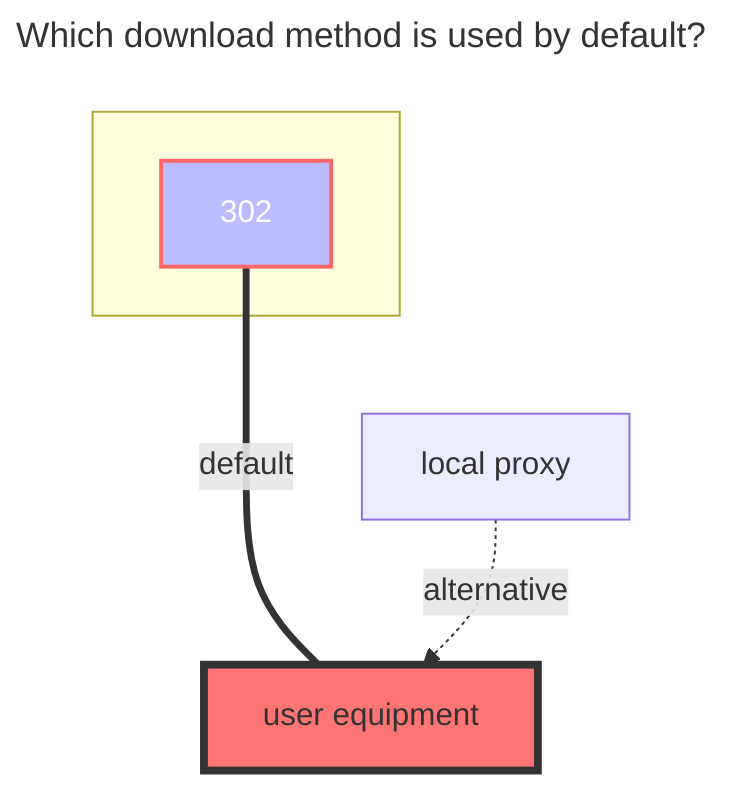

---
# This is the icon of the page
icon: iconfont icon-state
# This control sidebar order
order: 41
# A page can have multiple categories
category:
  - Guide
# A page can have multiple tags
tag:
  - Storage
  - Guide
  - "302"
# this page is sticky in article list
sticky: true
# this page will appear in starred articles
star: true
---
# GitHub Releases

:::tip
GitHub API rate limits: The primary rate limit for unauthenticated requests is 60 requests per hour. Making API requests using a personal access token counts toward your personal rate limit of 5,000 requests per hour.
:::

## Repo Structure

:::tabs#UrlTree
@tab 1

The simplest usage is to directly write `owner/repository`, only one can be filled in.

##### Input

``` 
alistGo/alist
```

The effect is the same as the following:
``` 
/:alistGo/alist
```

@tab 2

Mount to a subdirectory, you can mount multiple repositories

##### Input

``` 
/alist-gh:alistGo/alist
/alist-web-gh:alistGo/alist-web
```

The leading `/` can be omitted:

``` 
alist-gh:alistGo/alist
alist-web-gh:alistGo/alist-web
```

:::

## Show README file

Off switch：
```
alist/
├── alist-linux-amd64.tar.gz
└── alist-windows-amd64.zip
```

On switch：
```
alist/
├── alist-linux-amd64.tar.gz
├── alist-windows-amd64.zip
├── README.md
├── README_cn.md
└── LICENSE
```

If enabled, the total size and modification time of the folder will not be displayed.

## Token

Required when accessing private repositories, and can also reduce the impact of rate limits.

Log in GitHub and visit: <https://github.com/settings/tokens>

## Show all version

Off switch:
```
alist/
├── alist-linux-amd64.tar.gz
└── alist-windows-amd64.zip
```

On switch：
```
alist/
├── v3.41.0/
│   ├── alist-linux-amd64.tar.gz
│   └── alist-windows-amd64.zip
├── v3.40.0/
│   ├── alist-linux-amd64.tar.gz
│   └── alist-windows-amd64.zip
└── v3.39.4/
    ├── alist-linux-amd64.tar.gz
    └── alist-windows-amd64.zip
```

### **The default download method used**



