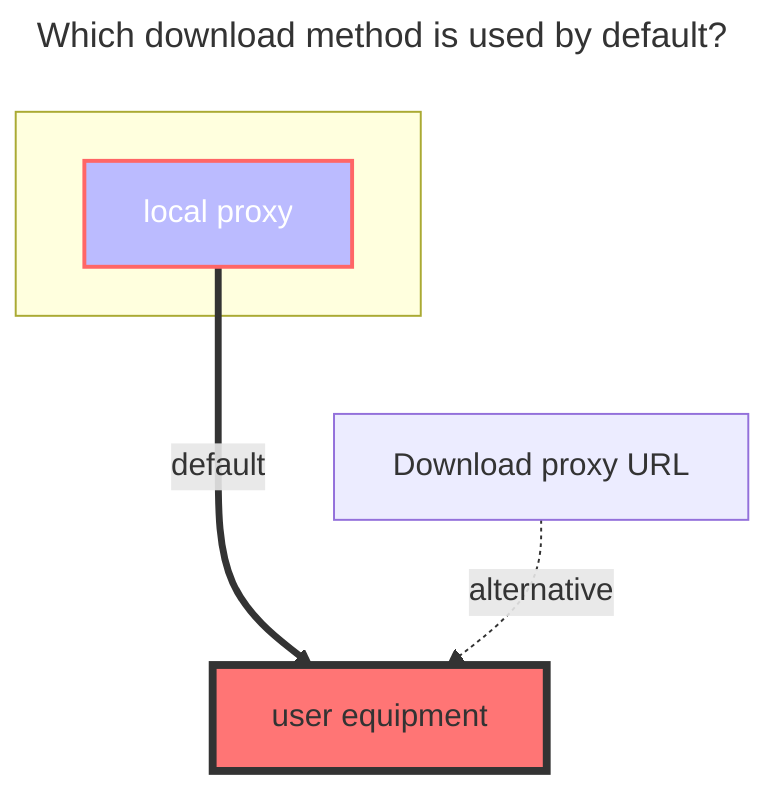

---
# This is the icon of the page
icon: fa-solid fa-x
# This control sidebar order
order: 161
# A page can have multiple categories
category:
  - Guide
# A page can have multiple tags
tag:
  - Storage
  - Guide
  - "Native Rroxy"
# this page is sticky in article list
sticky: true
# this page will appear in starred articles
star: true
watermark:
  content: The personal version has been officially offline on December 31, 2024
  globalAlpha: 0.4
  rotate: 10
  width: 650
  height: 300
---

# vtencent 

vtencent Official website link：**https://app.v.tencent.com**

:::caution The service has been shut down and cannot be used.

The personal version of vtencent has been officially offline on ==December 31, 2024==.

- **https://mp.weixin.qq.com/s/bfKVkF3iVMMQsh6FNo_UTg**

:::

 

### **Cookie**

Just find a parameter carrying Cookie in the F12 request and copy it

- It is recommended to use the Cookie parameter in the request refreshed later, which will carry the Cookie containing the **`tf_x`** parameter.

- `login`、`DescribeTasks`、`DescribeAccount`、`DescribeUserProfile`、`DescribePlatformSettings`、`CreateBindWechatQRCode`

The cookies that can be used are those that need to carry the **`tf_x`** parameter. In the example in the figure, the one on the left can be used, but the one on the right cannot be used.

 

### **Root Folder ID**

The root directory ID is: `9`. If you want to mount other subfolders separately, refer to the method of AliCloud

- If it is still not displayed after filling in, please manually refresh the button on the lower right corner.

 

### **Tf uid**

No need to fill in, store and fill in the correct cookie, `Tf uid` will be filled in automatically after saving

 

### **The default download method used**

