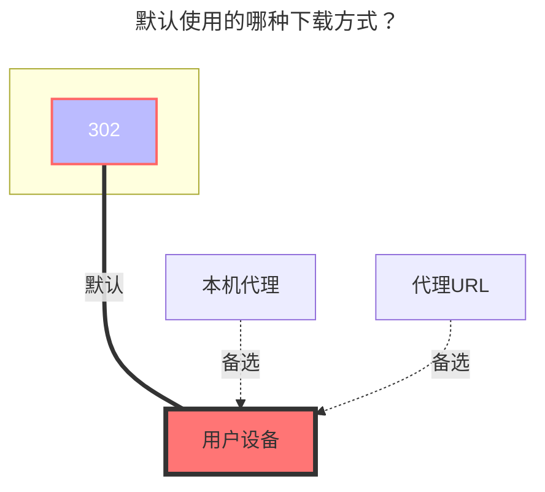

---
# This is the icon of the page
icon: iconfont icon-state
# This control sidebar order
order: 21
# A page can have multiple categories
category:
  - Guide
# A page can have multiple tags
tag:
  - Storage
  - Guide
  - "302"
  - "官方"
# this page is sticky in article list
sticky: true
# this page will appear in starred articles
star: true
headerDepth: 5
---

# 115 Open

::: tip

使用官方  [**115开放平台 API**](https://open.115.com) 开发

:::

::: danger 请仔细阅读注意事项

请规范使用帐号，请勿包含但不限于 **`多人共享使用`**、**`图床、软件床`** 和 **`视频外链到视频网站播放`** 等分发服务以及一些没有提到的不规范使用的方式导致帐号被封禁后果自负

:::

<br/>


## **获取刷新令牌**

- **https://alist.nn.ci/zh/tool/115/token**

手机扫码后点击蓝色按钮即可获取 `refresh token`

填写时只需要填写 **`refresh token`** 就可以，不需要填写 `access token`


<br/>


### **注意事项**

::: warning Token 泄漏后处理方法

如果不小心泄漏了 Token，可以前往115设备登录管理解除应用授权

- 115 APP：【**iOS** 、**Android**】版本 需要 ≥ 35.11.0
- 115 网页端：**https://115.com/?mode=device_manage**

失效后会提示如下内容：

```json
failed get objs: failed to list objs: code: 40140116, message: no auth
```

一个帐号可以在同一个应用获取两次`Refresh token`，第三次获取后第一次获取到的`Refresh token`就会失效，使用第一个`Refresh token`会提示上面的错误


:::


<br/>

### **使用其他 APP ID 获取刷新令牌**

例如使用自己申请的开发者应用ID获取刷新令牌，在获取刷新令牌前先填写应用`APP ID`再点击获取刷新令牌按钮


<br/>


## **根文件夹ID**

默认根目录ID为：`0`

打开 115 网盘官网，点击进入要设置的文件夹时点击 URL 中 `cid`后面的数字

如 <https://115.com/?cid=249163533602609229&offset=0&tab=&mode=wangpan>

这个文件夹的 `根文件夹ID` 即为 `249163533602609229`

<br/>


### **默认使用的下载方式**


