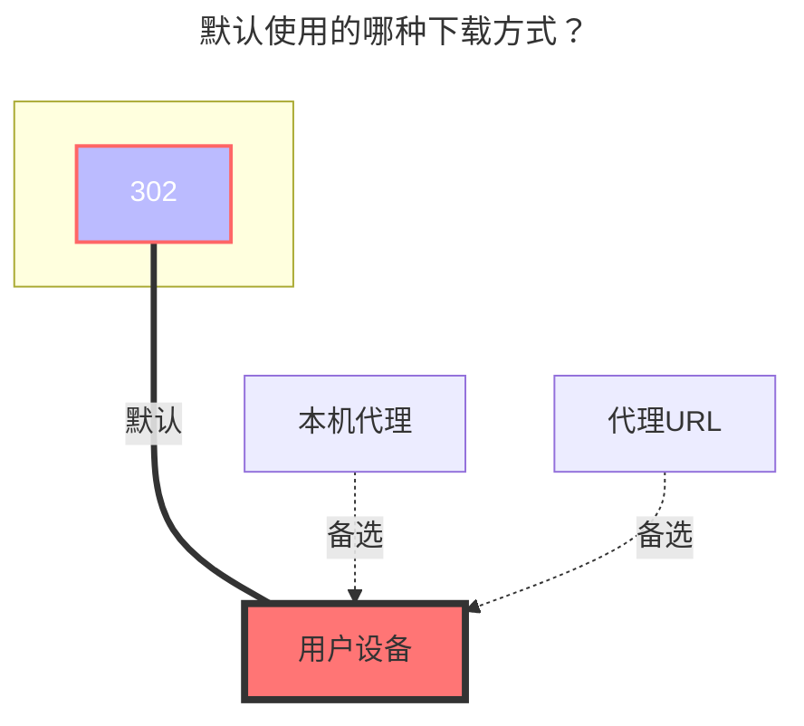

---
# This is the icon of the page
icon: iconfont icon-state
# This control sidebar order
order: 25
# A page can have multiple categories
category:
  - Guide
# A page can have multiple tags
tag:
  - Storage
  - Guide
  - "302"
# this page is sticky in article list
sticky: true
# this page will appear in starred articles
star: true
headerDepth: 5
---

# 115 Open

::: tip

使用  [**115开放平台**](https://open.115.com/) 开发

:::

<br/>


## **获取刷新令牌**

- **https://alist.nn.ci/zh/tool/115/token**

手机扫码后点击蓝色按钮即可获取 `refresh token`


<br/>


### **注意事项**

::: warning Token 泄漏后处理方法

如果不小心泄漏了 Token，可以马上重新获取一个新的刷新令牌，之前的就会失效，失效后会提示如下内容：

```html
failed get objs: failed to list objs: error: refresh token error, errno: 0
```

:::

新获取的刷新令牌无法直接在原驱动內进行更换刷新令牌，api接口有限流，短时间内不能连续刷新，只能删掉原驱动重新添加（如果还提示则等待1分钟再尝试，使用新的 `refresh token`）

```html
Failed init storage but storage is already created: failed init storage: error: refresh frequently, errno: 0
```


<br/>


## **根文件夹ID**

默认根目录ID为：`0`

打开 115 网盘官网，点击进入要设置的文件夹时点击 URL 中 `cid`后面的数字

如 <https://115.com/?cid=249163533602609229&offset=0&tab=&mode=wangpan>

这个文件夹的 `根文件夹ID` 即为 `249163533602609229`

<br/>


### **默认使用的下载方式**


