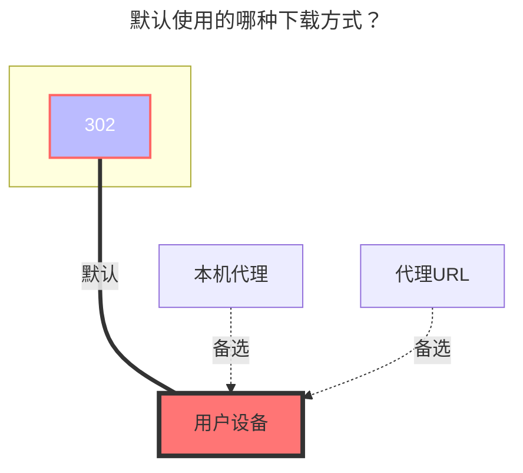

---
# This is the icon of the page
icon: iconfont icon-state
# This control sidebar order
order: 7
# A page can have multiple categories
category:
  - Guide
# A page can have multiple tags
tag:
  - Storage
  - Guide
  - "302"
# this page is sticky in article list
sticky: true
# this page will appear in starred articles
star: true
---

# 中国移动云盘

云盘地址：**<https://yun.139.com/>**

:::warning

AList版本必须大于 `v3.41.0` 版本才能使用本教程！

:::

:::tip

相关参数可通过 浏览器开发工具 -> 网络 -> 请求 [搜索关键词](#搜索关键词)获取！

:::

 

## **代理range**

需要先启用 `Web代理` 或者 `Webdav本地代理` 才会生效。

- 目前仅适用于：`别名`、`中国移动云盘`、`AList V3`

  - 具体功能说明：**<https://github.com/alist-org/alist/pull/6496#issue-2309839607>**

 

## **Authorization**

已更换鉴权方式，请获取 `Authorization` 进行填写。

:::warning

只需要填写 Basic 空格后面开始的内容，**不要包含 Basic**！

:::

 

## **类型**

Alist 目前支持挂载 4 种类型：

- 新个人云：新 API

  - 注意：移动已于 2024 年底迁移账号到新的个人云

  - 新的个人云使用 PUT 方法直连 EOS 分片上传

- 家庭云：我的家庭 -> 家庭文件

  - 限制：家庭云不支持复制、移动、重命名文件夹，根目录无法上传文件

  - 家庭云使用 POST 方法断点续传

- 共享群：共享群组

  - 限制：共享群组不支持复制、上传

- 个人云：旧的个人云，已成为历史

 

## **根文件夹ID**

文件夹ID，用于指定挂载的目录。

:::warning

更改类型后请记得清空或修改根文件夹ID！

:::

- 新个人云：`/`，可以为空会自动填写，会将所有的都列出来

  - 若想挂载单独某个文件夹，请填写文件夹ID。

- 家庭云：根目录为空就是全部文件

  - 若想挂载单独某个文件夹，请填写文件夹ID。

- 共享群：为空会自动填写群组ID，建议填写手动获取的文件夹ID

  - 若想挂载单独某个文件夹，请填写文件夹ID。

  - 注意：如果想挂载别人创建的共享群，请务必填写手动获取的文件夹ID，否则会出现在一级文件夹无限循环的问题。

- 个人云：`root`，可以为空会自动填写，会将所有的都列出来，涵盖18项(自行查看)，正常文件在 **我的文件夹** 这个里面

  - 如果写文件夹ID列出的是正常的根目录文件夹

 

## **Cloud ID**

用于区分特殊存储的ID。个人云不需要填写，**家庭云、共享群专用**。

- 家庭云：家庭云ID，**不能为空**

- 共享群：群组ID，**不能为空**

 

## 自定义上传分片大小

可供用户自定义分片大小，单位是字节，如果出现性能问题请自行调整，设置 `0` 默认为 100 MB。

- 目前网页端的分片大小为 20 MB（20971520）。

- 新版个人云所使用的 [EOS 文档](https://ecloud.10086.cn/op-help-center/api/article/40933) 中说明“无法上传大小大于> 5 GB 的对象”，故分片大小不要超过 5 GB。

 

## **其他**

- 其他信息取自请求，已经从获取cookie改变成获取`Authorization`
  - 新个人云可以通过另外的方式获取详情查看[新个人云](#新个人云)的图片示例

- 请求信息中底部找不到`载荷`，就去顶部`上面一排`，标记了紫色高亮

 

### **搜索关键词**

注意查看关键词，获取 **`Authorization`** 、**根文件夹ID**、**Cloud ID**时使用

- 新个人云：hcy/file/**list**

  - 标头 - `Authorization`

  - 载荷 - `parentFileId`：文件夹ID

- 家庭云：**queryContentList**

  - 标头 - `Authorization`

  - 载荷 - `cloudID`：家庭云ID

  - 载荷 - `catalogID`：文件夹ID

  - 响应 - `data.path`：完整文件夹ID

- 共享群：**queryGroupContentList**

  - 标头 - `Authorization`

  - 载荷 - `groupID`：群组ID

  - 载荷 - `path`：完整文件夹ID

- 个人云：**getDisk**

 

### **新个人云：**

  
    

 

### **个人云：**

  
    
    

 

### **家庭云：**

  
    
    

::: details 手把手教学视频

虽然视频是V2版本，但是获取目录ID 和 Cloud ID的方式一样，

**<https://www.bilibili.com/video/BV1US4y1w79a>**

现在已经从获取Cookie的方式变成了获取`Authorization`，获取方式可以看下方[填写示例](#填写示例)教程

:::

 

### **AList挂载填写示例：**

- ==`Authorization`只需要填写Basic空格后面开始的内容==

- 新个人云文件夹ID，你进入文件夹后会自动变化，你需要哪个文件夹ID就进入哪个文件夹，然后获取`currentCatalogID`^图3^的值就可以

  
    
    
    

 

### **默认使用的下载方式**

