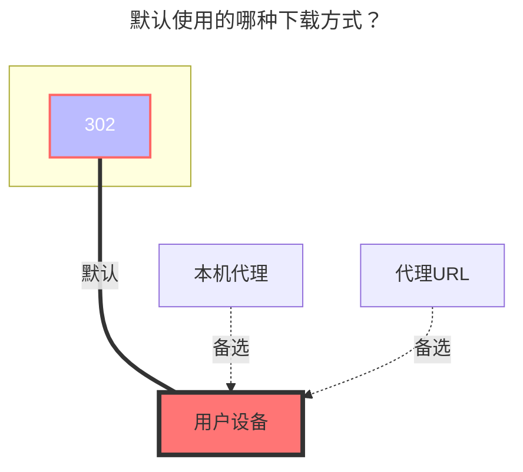

---
# This is the icon of the page
icon: iconfont icon-state
# This control sidebar order
order: 13
# A page can have multiple categories
category:
  - Guide
# A page can have multiple tags
tag:
  - Storage
  - Guide
  - "302"
# this page is sticky in article list
sticky: true
# this page will appear in starred articles
star: true
---

# 一刻相册

## **Cookie** <Badge text="v3.41.0" type="info" vertical="middle" />

登录 [一刻相册](https://photo.baidu.com) 打开F12随意找到一个携带 `Cookie` 值的请求进行复制就可以

 

## **相薄ID**

- **默认为空时,直接显示根目录全部相册.**
- 如果挂载单个相册时需填写如下内容

- 相薄ID 应填：{album_id}|{tid}     示例：4021858707431029901|316519298447849660

- {album_id} ：进入你需要挂载的相册后,查看顶部链接/album 后的ID就是 {album_id}

  - https://photo.baidu.com/photo/web/album/4021858707431029901   
  - **4021858707431029901**就是 {album_id} 

- {tid}:访问 **https://photo.baidu.com/youai/album/v1/list?limit=1000** 获取
  - 进入界面后`Ctrl+F`搜索上面的ID,在下面数几行就可以看到对应的 {tid} 

 

## **展示类型**

根据自己的需求选择

 

## **删除源文件**

<i class="fa-solid fa-triangle-exclamation fa-lg" style="color: #ff0000;"></i>‪‪ ‪ 默认只是移除相册，并非真正删除，如果开启此选项删除文件后将会彻底删除，谨慎开启

 

### **默认使用的下载方式**

