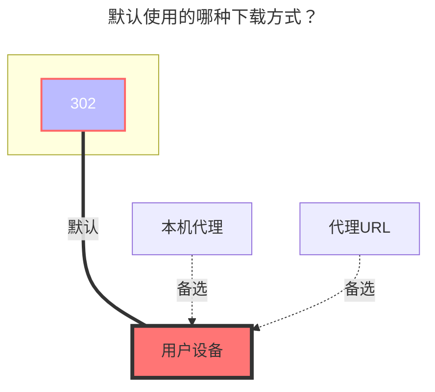

---
# This is the icon of the page
icon: iconfont icon-state
# This control sidebar order
order: 256
# A page can have multiple categories
category:
  - Guide
# A page can have multiple tags
tag:
  - Storage
  - Guide
  - "本地代理"
  - "302"
# this page is sticky in article list
sticky: true
# this page will appear in starred articles
star: true
---
# Cloudreve V3

## 参数说明

### 地址

Cloudreve V3 服务器的地址，如：`https://www.example.com`，最好删掉后面的斜线`/`。

### 鉴权

Cloudreve V3 使用 Cookie 进行鉴权，这意味着挂载鉴权方式分为：

1. `用户名`+`密码`：会自动使用登录接口获取 Cookie，存在验证码问题
2. 仅 `Cookie`：参数可从浏览器请求或者本地 Cookie 中找到，有效期未知
3. [引用](../drivers/common.html#引用)：`备注`填写 `ref:/{挂载路径}`，从 `已挂载的存储` 中引用认证、令牌等

Cookie 获取方法：

::: tip
仅需要 `cloudreve-session=` 后面一串即可。
:::

### 根文件夹路径

默认为：`/`，可从网页链接的 `?path=` 中获取。获取到的参数可能需要 [URL 解码](https://www.bing.com/search?q=URL+%E8%A7%A3%E7%A0%81)。

### 启用缩略图和文件夹大小

让 Cloudreve V3 服务端统计每个文件夹的大小并为每个文件生成略缩图，启用可能会造成服务端报错、运行缓慢，默认禁用。

### 自定义 UA

用于自定义请求使用的 `User-Agent` 头部信息。留空为 Alist 默认。

## 上传

支持上传到的存储策略如下：

- 本机存储
- 从机存储
- OneDrive
- S3

上传的存储策略请在 Cloudreve V3 网页端进入相应文件夹中进行设置（需要服务端为 Cloudreve Pro）。

## **默认使用的下载方式**

