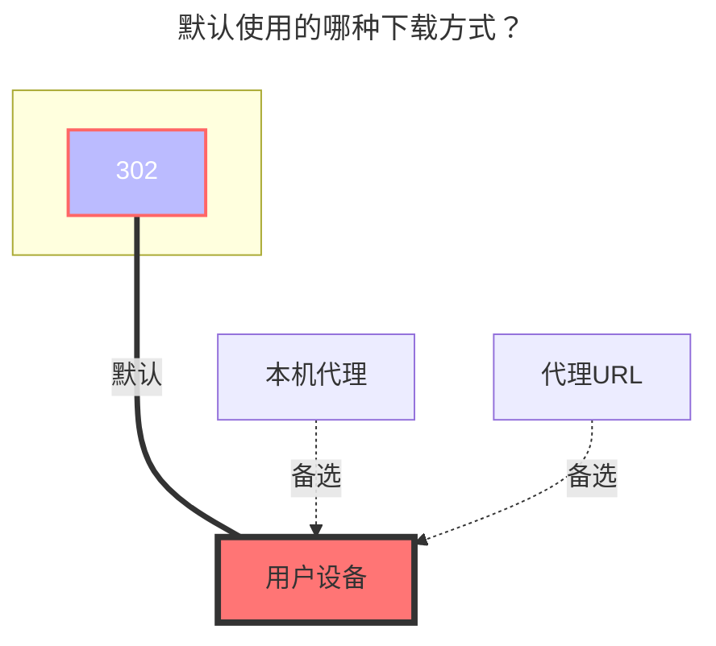

---
# This is the icon of the page
icon: iconfont icon-state
# This control sidebar order
order: 40
# A page can have multiple categories
category:
  - Guide
# A page can have multiple tags
tag:
  - Storage
  - Guide
  - "302"
# this page is sticky in article list
sticky: true
# this page will appear in starred articles
star: true
---
# GitHub API

:::tip
GitHub API 不支持操作 100M 或更大的文件，不支持操作含有超过 100,000 个子文件（夹）的文件夹。

本驱动会忽略仓库内的所有`.gitkeep`文件。

本驱动暂不支持操作子模块。
:::

## **Token**

1. 登录 GitHub，访问<https://github.com/settings/tokens>
2. 
3. 
4. 

## **所有者**

仓库的所有者，比如仓库链接是`github.com/AAA/BBB`，这里就填`AAA`。

## **仓库**

仓库名，比如仓库链接是`github.com/AAA/BBB`，这里就填`BBB`。

## **引用**

分支名、tag或提交SHA，只有在填写分支名的情况下驱动才可写，不填会使用默认分支。

## **Gh Proxy**

用于加速下载

- 下载 `Raw`、`archive` 的内容要改成 **https://gh-proxy.com/raw.githubusercontent.com**

```bash title="一键复制"
https://gh-proxy.com/raw.githubusercontent.com
```

```bash title="一键复制"
https://ghfast.top/raw.githubusercontent.com
```

```bash title="一键复制"
https://ghproxy.net/raw.githubusercontent.com
```

## **GPG 私钥**

GPG 私钥，用于提供提交验证功能，经验证的提交会在 GitHub 网页上被标记为绿色的“Verified”，使用以下命令获取，不需要验证功能可以留空。

```bash
gpg --export-secret-key -a <密钥对ID>
```

## **GPG 私钥密码**

GPG 私钥的密码，没有则留空。

## **提交者名称**

自定义提交者名称，不填会使用 Token 的所有者。

## **提交者邮箱**

自定义提交者邮箱，不填会使用 Token 的所有者。

填写“提交者名称”时必填，未填写“提交者名称”时必不填。

## **作者名称**

自定义作者名称，不填会使用 Token 的所有者。

## **作者邮箱**

自定义作者邮箱，不填会使用 Token 的所有者。

填写“作者名称”时必填，未填写“作者名称”时必不填。

## **提交信息**

自定义提交信息，支持以下模板变量：
- `UserName`: 发起操作的用户
- `ObjName`: 被操作文件（夹）的名称
- `ObjPath`: 被操作文件（夹）的路径
- `ParentName`: 被操作文件（夹）的父文件夹名称
- `ParentPath`: 被操作文件（夹）的父文件夹路径
- `TargetName`: （重命名时）新名称（复制、移动时）目标文件夹名称。
- `TargetPath`: （重命名时）新路径（复制、移动时）目标路径

### **默认使用的下载方式**



