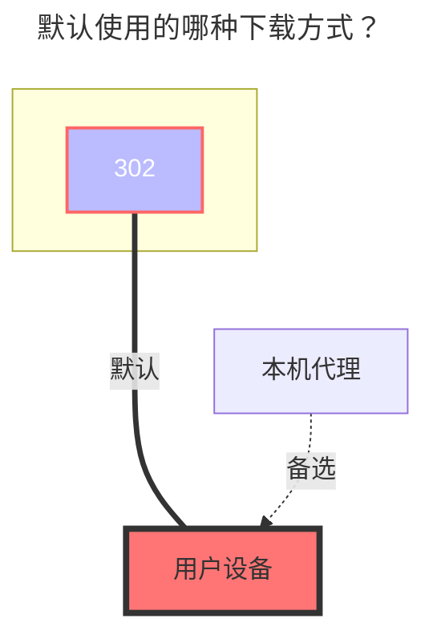

---
# This is the icon of the page
icon: iconfont icon-state
# This control sidebar order
order: 41
# A page can have multiple categories
category:
  - Guide
# A page can have multiple tags
tag:
  - Storage
  - Guide
  - "302"
# this page is sticky in article list
sticky: true
# this page will appear in starred articles
star: true
---
# GitHub Releases

:::tip
GitHub API 速率限制：未经身份验证的请求的主要速率限制为每小时 60 个请求。使用个人访问令牌发出 API 请求计入您每小时 5000 个请求的个人速率限制。
:::

## 仓库结构

:::tabs#UrlTree
@tab 1

最简单的用法，直接写 `所有者/仓库`，只能填一个

##### 输入

``` 
alistGo/alist
```

与下面的写法效果一致：
``` 
/:alistGo/alist
```

@tab 2

挂载到子目录，可以挂多个仓库

##### 输入

``` 
/alist-gh:alistGo/alist
/alist-web-gh:alistGo/alist-web
```

最前面的 `/` 可以省略：

``` 
alist-gh:alistGo/alist
alist-web-gh:alistGo/alist-web
```

:::

## 显示 README、LICENSE 文件

开启前：
```
alist/
├── alist-linux-amd64.tar.gz
└── alist-windows-amd64.zip
```

开启后：
```
alist/
├── alist-linux-amd64.tar.gz
├── alist-windows-amd64.zip
├── README.md
├── README_cn.md
└── LICENSE
```

开启后，不显示文件夹总大小和修改时间。

## 令牌

访问私有仓库时需要，也可减少速率访问限制的影响。访问：<https://github.com/settings/tokens>

## 显示所有版本

开启前：
```
alist/
├── alist-linux-amd64.tar.gz
└── alist-windows-amd64.zip
```

开启后：
```
alist/
├── v3.41.0/
│   ├── alist-linux-amd64.tar.gz
│   └── alist-windows-amd64.zip
├── v3.40.0/
│   ├── alist-linux-amd64.tar.gz
│   └── alist-windows-amd64.zip
└── v3.39.4/
    ├── alist-linux-amd64.tar.gz
    └── alist-windows-amd64.zip
```

### **默认使用的下载方式**



